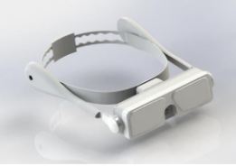
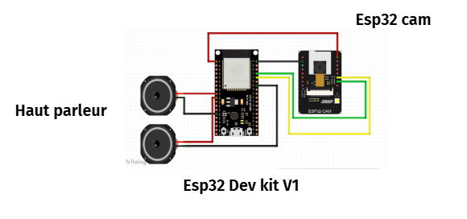
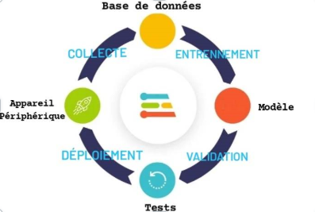

# Smart Glasses for Blind Persons
# This project was made by Amani Dhaouadi and Houssem Eddine Sfaxi.
This project aims to assist blind individuals by offering practical and intuitive solutions for everyday challenges. The smart glasses are designed with advanced features, such as obstacle detection and assisted navigation, to enhance confidence and autonomy in mobility.

---

## **Presentation of the Model**

The glasses provide practical and intuitive assistance, making daily life easier for users. Thanks to advanced functionalities like obstacle detection and assisted navigation, these glasses boost the confidence and independence of blind people. With this innovative model, we aim to significantly improve their quality of life.

---

## **Proposed Solution**

1. Utilizing cutting-edge technology TinyML.
2. Employing ESP32-CAM with Arduino IDE and Edge Impulse for object detection model creation.
3. Implementing a personalized text-to-speech model compatible with user preferences.

### **Components for the Project**

- ESP32 DevKit
- ESP32-CAM
- Speaker

---

## **Implementation**

### **Steps to Realization**

1. **Training the Object Detection Model with Edge Impulse**
2. **Object Detection (ESP32-CAM)**
3. **Text-to-Speech Synthesis (ESP32 DevKit)**

---

## **System Development**

### **Object Detection Model Training**

1. **Model Training Steps**
   - Create an Edge Impulse account and start a new project.
   - Follow steps: data collection and labeling, training, evaluation, and model deployment.

2. **Data Collection and Labeling**
   - Build a database of object images in various environments.
   - Upload data to Edge Impulse and define categories for training or testing.
   - Split data (e.g., 80% for training, 20% for testing) to avoid bias.
   - Optional manipulations: cropping, renaming, deletion, etc.
   - Use AI-assisted (YOLOv5) or manual labeling for object tagging.

3. **Model Training**
   - Create an Impulse with 3 main blocks:
     - Input Block: Configure input data (e.g., images, size, resizing mode).
     - Processing Block: Feature extraction (e.g., RGB or grayscale).
     - Learning Block: Neural network using FOMO (MobileNet V2) with adjustable learning rates.
   - Train over several cycles to achieve precision (e.g., best F1 score: 76.7%).

4. **Model Evaluation**
   - Test via Edge Impulse, achieving overall accuracy of 71.01% with room for improvement.

5. **Model Deployment**
   - Create and download a custom Arduino library for model execution.

### **Visuals**

---

## **Hardware Setup and Testing**

### **1. Implementation of the Edge Impulse Library**

- Import the library ZIP via the "Sketch" menu in Arduino IDE.
- Load the "static buffer" example from the Edge Impulse library.

### **2. Installation of ESP32-CAM Board**

- Add the ESP32 board link to the Board Manager in Arduino IDE.
- Install the ESP32 boards via the Board Manager.

### **3. Configuration of ESP32-CAM Board**

- Select the appropriate communication port (e.g., COM3).
- Enable PSRAM for the ESP32-CAM AI-Thinker board.
- Configuration settings:
  - Model: ESP32 Wrover Module
  - Partition: Default 4MB with SPIFFS
  - Speed: 115200

### **4. Object Detection Test**

- Use the FOMO model with ESP32-CAM for real-time object detection.
- Display results via serial communication with LED activation on detection.

---

## **Text-to-Speech Synthesis (TTS) with ESP32**

### **1. Verify ESP32-CAM Functionality**

- Ensure proper functioning of object detection on ESP32-CAM before developing the TTS feature.

### **2. Configure ESP32 DevKit Board**

- Select "DOIT ESP32 DEVKIT V1" model and port in Arduino IDE.

### **3. Audio Processing with Audacity**

- Import audio files and adjust:
  - Sample rate: 48,000 Hz
  - Channel: Mono
  - Resolution: 32 bits
- Convert audio file to hexadecimal code using HxD and integrate it into Arduino code.

### **4. Test Text-to-Speech Functionality**

- Generate audio signals via GPIO 25 of ESP32 connected to a speaker.
- Use the "audio()" function triggered by received keywords (e.g., "table") to produce corresponding sounds.

---

## **Additional Visuals**

---
